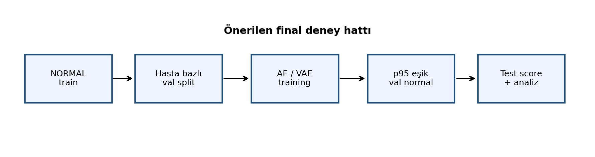
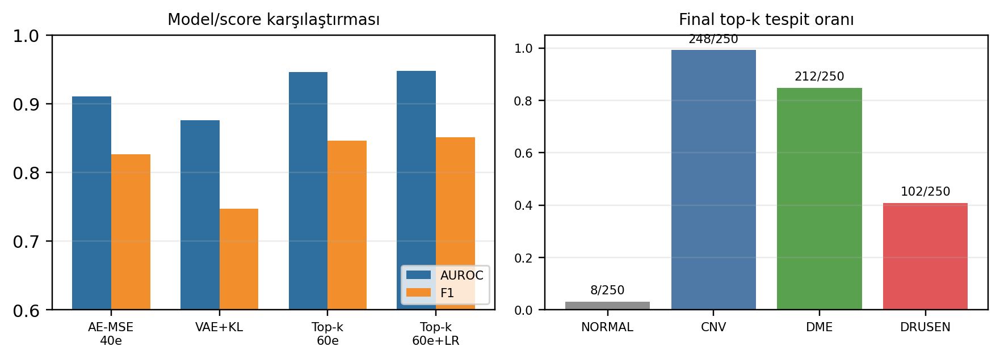
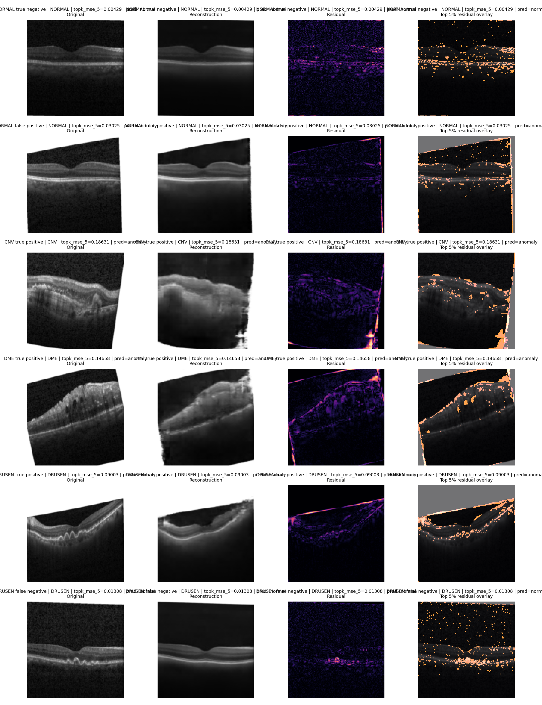
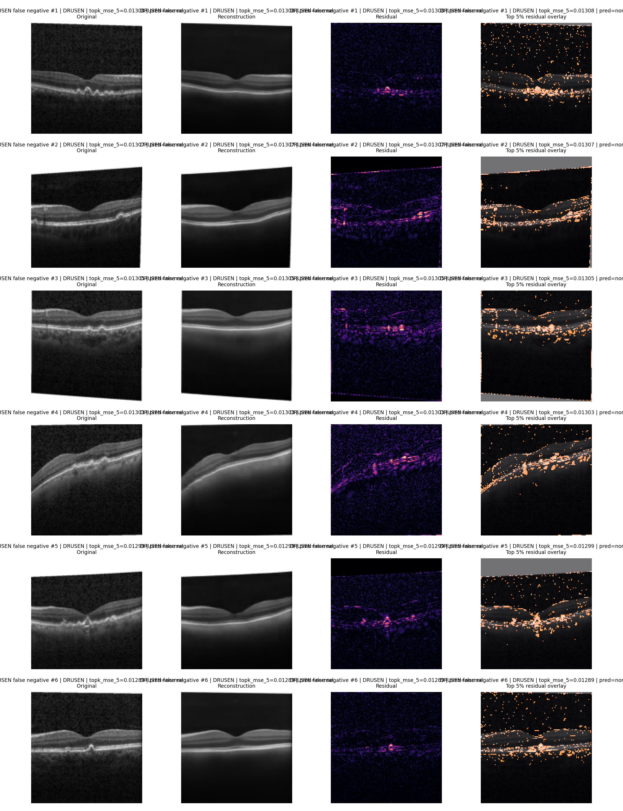

# Normal Retina OCT Görüntülerinden Öğrenilen Konvolüsyonel Autoencoder ile Patolojik Örneklerin Top-k Rekonstrüksiyon Hatası Tabanlı Tespiti

**English title:** Top-k Reconstruction-Error-Based Detection of Pathological Retinal OCT Images Using a Convolutional Autoencoder Trained on Normal Samples

## Özet
Bu çalışmada retinal OCT görüntülerinde patolojik örneklerin tespiti için yalnızca normal görüntülerle eğitilen konvolüsyonel autoencoder tabanlı bir anomali tespit hattı geliştirilmiştir. Kermany OCT2017/Mendeley veri kümesinde eğitim aşamasına sadece NORMAL sınıfı alınmış, doğrulama bölmesi hasta kimliği kullanılarak ayrılmış ve test aşamasında CNV, DME, DRUSEN ve NORMAL örnekleri binary anomaly detection problemi olarak değerlendirilmiştir. Final aşamasında ara baseline korunmuş; VAE+KL, L1, MSE+SSIM, latent boyut, batch size, crop ön işleme, learning rate scheduler, farklı anomaly score'lar, hasta düzeyi birleştirme ve bootstrap güven aralığı denemeleri eklenmiştir. En iyi image-level sonuç, ReduceLROnPlateau ile 60 epoch eğitilen AE-MSE modelinin topk_mse_5 score'u ile AUROC 0.9474, F1 0.8515, precision 0.9860, recall 0.7493 ve FPR 0.0320 olarak bulunmuştur. Hasta düzeyinde mean aggregation ile F1 0.9066 elde edilmiştir. Sonuçlar top-k residual score'un klasik ortalama MSE'ye göre daha ayırt edici olduğunu, buna karşılık DRUSEN örneklerinin hala en zor patolojik grup olduğunu göstermektedir.

## Abstract
This project develops a convolutional autoencoder pipeline for detecting pathological retinal OCT images by learning only from normal samples. Using the Kermany OCT2017/Mendeley dataset, only NORMAL images were used for training, the validation subset was separated at patient level, and CNV, DME, DRUSEN and NORMAL test images were evaluated as a binary anomaly detection task. In the final stage, the baseline was extended with VAE+KL, L1, MSE+SSIM, latent-size and batch-size ablations, crop preprocessing trials, learning-rate scheduling, alternative anomaly scores, patient-level aggregation and bootstrap confidence intervals. The best image-level setting was the 60-epoch AE-MSE model trained with ReduceLROnPlateau and evaluated with topk_mse_5 scoring, reaching AUROC 0.9474, F1 0.8515, precision 0.9860, recall 0.7493 and FPR 0.0320. Patient-level mean aggregation achieved F1 0.9066. The findings indicate that localized top-k residual scoring improves separability over mean MSE, while DRUSEN remains the most challenging pathology group.

## Anahtar Kelimeler / Keywords
retinal OCT, anomaly detection, autoencoder, reconstruction error, top-k residual, VAE, SSIM, medical imaging, deep learning

## Giriş
Optik koherens tomografi (OCT), retina katmanlarını yüksek çözünürlükte görüntüleyebildiği için CNV, DME ve DRUSEN gibi patolojilerin değerlendirilmesinde önemli bir görüntüleme yöntemidir. Buna karşın gerçek klinik senaryolarda tüm patoloji türleri için yeterli ve güvenilir etiket toplamak her zaman kolay değildir. Denetimli sınıflandırma modelleri güçlü sonuçlar verebilse de, etiket bağımlılığı ve dağılım dışı örneklere karşı kırılganlık bu tür sistemlerin pratik kullanımında önemli sınırlardır [1], [3]. Bu nedenle bu projede hastalık türünü doğrudan sınıflandırmak yerine, normal retina anatomisini öğrenen bir modelin patolojik görüntülerde daha yüksek rekonstrüksiyon hatası üretmesi fikri incelenmiştir.

Ara rapor aşamasında çalışan bir AE-MSE baseline kurulmuştu. Final aşamasında amaç sadece tek bir sonucu iyileştirmek değil, aynı zamanda hangi teknik kararların işe yaradığını sistematik olarak görmekti. Bu kapsamda VAE tabanlı üretken latent model, L1 ve SSIM içeren loss seçenekleri, latent boyut ve batch size ablasyonları, learning rate scheduler, boş alanları azaltmaya yönelik crop denemeleri, top-k residual score, hasta düzeyi değerlendirme, bootstrap güven aralığı ve nitel heatmap görselleri aynı deney hattına eklenmiştir. Bu nedenle final raporu ara rapordaki başlangıç fikrini temel almakla birlikte, asıl olarak finalde yapılan genişletmeleri ve bunların kontrollü karşılaştırmasını sunmaktadır. Böylece proje, yalnızca bir model çalıştırma örneği olmaktan çıkarılıp savunulabilir bir karşılaştırmalı analiz haline getirilmiştir.

## Literatür
Kermany ve arkadaşlarının OCT2017 veri kümesi ve derin öğrenme çalışması, retina OCT görüntülerinde denetimli tanı sınıflandırmasının güçlü bir örneğini sunar [1], [2]. Daha genel tıbbi görüntüleme literatürü de derin öğrenmenin yüksek performans potansiyelini göstermektedir [3]. Ancak bu çizgideki modeller çoğunlukla her sınıf için etiketli örnek gerektirir. Anomali tespiti literatüründe AnoGAN, GANomaly ve DRAEM gibi çalışmalar, normal dağılımdan sapmayı rekonstrüksiyon veya adversarial öğrenme yoluyla yakalamaya çalışmıştır [6]-[8]. VAE yaklaşımı, olasılıksal latent uzay yapısıyla bu probleme doğal bir alternatif sunar [4]. SSIM ise piksel farkından farklı olarak yapısal benzerliği ölçtüğü için rekonstrüksiyon kalitesini değerlendirmede anlamlı bir bileşen olabilir [5].

Retinal OCT özelinde Seebock ve arkadaşları belirsizlik tabanlı anomali tespiti, Luo ve arkadaşları çok çözünürlüklü autoencoder, Wang ve arkadaşları ise zayıf denetimli anomali segmentasyonu üzerine çalışmıştır [9], [11], [12]. ProxyAno çalışması ise rekonstrüksiyon tabanlı yöntemlerin önemli bir riskini vurgular: model bazı anomalileri de iyi reconstruct edebilir ve bu durum duyarlılığı düşürebilir [10]. Bu proje bu literatürü doğrudan büyük bir modelle yeniden üretmek yerine, OCT2017 üzerinde normal-only, hasta düzeyinde kontrollü ve tekrar üretilebilir bir baseline ile bu riskleri deneysel olarak incelemektedir.

Literatürdeki bu çalışmaların önemli bir kısmı daha karmaşık mimariler, ek anotasyonlar veya özel ön işleme varsayımları kullanmaktadır. Bu projede bilinçli olarak daha sade bir mimariyle başlanmıştır; çünkü final hedefi yalnızca yüksek bir tek skor üretmek değil, hangi kararın hangi sonucu değiştirdiğini açıklayabilmektir. Bu nedenle VAE, SSIM, crop ve score ensemble gibi seçenekler aynı veri protokolü altında karşılaştırılmıştır. Böyle bir kurgu, daha gelişmiş yöntemlere geçmeden önce güvenilir bir baseline oluşturmayı ve DRUSEN gibi zor sınıflarda hatanın nereden geldiğini tartışmayı kolaylaştırmaktadır.

| Küme | Örnek | Projeye etkisi |
| --- | --- | --- |
| OCT sınıflandırma | Kermany et al. [1] | Veri seti ve sınıflar için temel referans. |
| Generative AD | AnoGAN, GANomaly [6], [7] | Rekonstrüksiyon tabanlı anomaly detection motivasyonu. |
| VAE / SSIM | Kingma, Wang [4], [5] | VAE+KL ve MSE+SSIM denemeleri için dayanak. |
| Retinal OCT AD | Seebock, Luo, Wang [9], [11], [12] | DRUSEN zorluğu ve lokal hata analizi için bağlam. |
| Sınırlılık | ProxyAno [10] | Anomalilerin de iyi reconstruct edilebilme riski. |

## Yöntem
Veri seti olarak Kermany OCT2017/Mendeley V3 kullanılmıştır. Klasör sözleşmesi data/oct2017/{train,test}/{NORMAL,CNV,DME,DRUSEN} biçiminde tutulmuştur. Eğitimde 40715 NORMAL görüntü, doğrulamada 10425 NORMAL görüntü kullanılmıştır; test kümesi ise her sınıftan 250 görüntü olmak üzere toplam 1000 görüntü içermektedir. Dosya adlarındaki hasta kimliği parse edilerek train ve validation arasında hasta kesişimi engellenmiştir. Patient-level aggregation sırasında farklı sınıflardaki aynı sayısal ID'lerin karışmaması için class prefix korunmuştur; örneğin NORMAL-0101 ve CNV-0101 farklı hasta anahtarları olarak tutulmuştur. Eğitim verisine hiçbir patolojik sınıf alınmamış, eşik seçimi yalnızca validation NORMAL score dağılımından yapılmıştır. Tüm görüntüler gri seviyeye çevrilmiş, 128x128 boyutuna getirilmiş ve [0,1] aralığında normalize edilmiştir.

Ana model dört bloklu konvolüsyonel autoencoder yapısındadır. Encoder, görüntüyü düşük boyutlu latent temsile indirger; decoder aynı uzaydan görüntüyü yeniden oluşturur. Ana koşuda latent_dim=128, Adam optimizer, initial learning rate 1e-3, ReduceLROnPlateau scheduler, batch size 32, maksimum 60 epoch ve early stopping patience 10 kullanılmıştır. Scheduler validation loss plateau olduğunda learning rate'i factor 0.5 ile düşürecek şekilde ayarlanmıştır. Eğitim NVIDIA GeForce RTX 4060 Laptop GPU üzerinde yapılmış ve final koşu yaklaşık 46.9 dakika sürmüştür. VAE denemesinde encoder mu ve logvar üretmiş, reparameterization trick kullanılmış ve loss MSE + 1e-4 * KL olarak alınmıştır. SSIM denemesinde loss 0.8*MSE + 0.2*(1-SSIM), L1 denemesinde ise ortalama mutlak hata kullanılmıştır.

Deney tasarımında iki ayrım korunmuştur. Birincisi, training loss ve anomaly score her zaman aynı olmak zorunda değildir; örneğin model MSE ile eğitildikten sonra aynı rekonstrüksiyonlardan farklı score türleri hesaplanmıştır. İkincisi, eşik seçimi ile performans değerlendirmesi ayrılmıştır; p95 eşiği validation normal skorlarından alınmış, test verisi yalnızca bu eşik sabitlendikten sonra değerlendirilmiştir. Bu ayrım, test setine göre threshold ayarlama riskini azaltmıştır.

Başlangıç anomaly score'u piksel başına ortalama MSE'dir. Finalde daha lokal patolojik farklılıkları yakalamak için topk_mse_5 score'u kullanılmıştır; bu score, kare hata haritasındaki en yüksek yüzde 5 pikselin ortalamasını alır. Score ablation aşamasında mse, l1, ssim_error, mse_ssim_score, retina_band_mse, retina_weighted_mse, topk_mse_5, topk_mse_10, ensemble_mse_l1, ensemble_mse_l1_ssim, ensemble_mse_retina, ensemble_mse_ssim_topk, ensemble_l1_ssim_topk, ensemble_mse_l1_retina ve ensemble_all_base seçenekleri hesaplanmıştır. Tablo V, bu geniş listenin rapor içinde okunabilir kalması için en açıklayıcı alt kümesini göstermektedir; tam CSV çıktıları proje klasöründe saklanmıştır. Ana operasyon eşiği tüm modeller için p95 olarak tutulmuş, p97 ve p99 değerleri yalnızca karşılaştırma amacıyla saklanmıştır. Bu tercih önemlidir; çünkü test seti threshold seçiminde kullanılmamış, test yalnızca son değerlendirme için ayrılmıştır. Hasta düzeyi değerlendirmede aynı hasta ID'sine ait görüntü score'ları mean aggregation ile birleştirilmiştir. Sonuçların belirsizliğini görmek için bootstrap ile AUROC ve F1 için yüzde 95 güven aralıkları hesaplanmıştır. Nitel analiz için residual heatmap overlay, top-k residual grid ve DRUSEN false negative örnekleri üretilmiştir. Bu görseller pixel-level anotasyon olmadığı için segmentasyon çıktısı olarak değil, modelin hangi bölgelerde yüksek hata ürettiğini gösteren açıklayıcı destek olarak yorumlanmıştır.

Metrik tarafında AUROC, threshold'dan bağımsız genel ayrıştırma gücünü verdiği için ana metrik olarak seçilmiştir. Precision, patolojik olarak işaretlenen görüntülerin ne kadarının gerçekten patolojik olduğunu; recall, patolojik örneklerin ne kadarının yakalandığını; F1 ise precision-recall dengesini göstermektedir. FPR özellikle önemlidir, çünkü normal görüntüleri gereksiz yere patolojik işaretlemek gerçek klinik akışta ek inceleme yükü oluşturabilir. Bu nedenle final model seçimi yalnızca AUROC değerine göre değil, F1, recall, precision ve FPR birlikte değerlendirilerek yapılmıştır.

Ön işleme denemeleri ayrı bir karar noktası olarak ele alınmıştır. OCT görüntülerinde üst veya alt bölgede siyah/beyaz boş alanlar bulunabildiği için content crop ve retina-margin crop denenmiştir. Ancak bu kesme işlemleri bazı örneklerde retina çevresindeki bağlamı değiştirme riski taşımaktadır. Bu yüzden crop yaklaşımları doğrudan final modele alınmamış, önce önizleme görselleriyle incelenmiş, ardından yalnızca anlamlı görünen seçenekler tam eğitim koşusuna taşınmıştır. Sonuçlar, görsel olarak makul görünen crop işlemlerinin bile anomaly score dağılımını her zaman iyileştirmediğini göstermiştir.

| Bölme | Sınıf | Görüntü | Hasta |
| --- | --- | --- | --- |
| train | NORMAL | 40715 | 2747 |
| val | NORMAL | 10425 | 687 |
| test | CNV | 250 | 178 |
| test | DME | 250 | 167 |
| test | DRUSEN | 250 | 169 |
| test | NORMAL | 250 | 171 |

| Ayar | Değer |
| --- | --- |
| Ana model | 4 bloklu convolutional autoencoder |
| Final run | ae_mse_l128_e60_plateau |
| Giriş | 128x128 gri seviye, [0,1] normalizasyon |
| Latent / batch | 128 / 32 |
| Optimizer | Adam, initial lr=0.001 |
| LR scheduler | plateau, factor=0.5, patience=3, min_lr=1e-05 |
| Epoch / patience | 60 / 10 |
| Ana threshold | validation NORMAL dağılımından p95 |
| Eğitim süresi | 46.9 dakika, best epoch 60 |
| Cihaz | NVIDIA GeForce RTX 4060 Laptop GPU |

## Bulgular
Tablo IV final aşamasında yapılan ana deneyleri özetlemektedir. Ara baseline olan AE-MSE 40 epoch koşusu AUROC 0.9104 ve F1 0.8262 üretmiştir. Aynı model 60 epoch eğitildiğinde validation loss düşmüş, ancak klasik ortalama MSE score'u tek başına büyük bir sıçrama sağlamamıştır. Son ek denemede ReduceLROnPlateau scheduler kullanılmış; learning rate 36. epoch'ta 1e-3'ten 5e-4'e düşmüş ve best validation loss 60. epoch'ta 0.000669 olmuştur. Scheduler ile eğitilen model ortalama MSE score'unda küçük bir iyileşme üretmiş, asıl iyileşme ise topk_mse_5 score ile gelmiştir: final koşu AUROC 0.9474 ve F1 0.8515 değerine ulaşmıştır. Bu sonuç, OCT patolojilerinin tüm görüntüye yayılmak yerine sınırlı bölgelerde yoğunlaşabildiğini ve ortalama MSE'nin bu sinyali zayıflatabildiğini göstermektedir.

VAE+KL, L1 ve MSE+SSIM denemeleri beklenen iyileştirmeyi sağlamamıştır. VAE özellikle DRUSEN sınıfında zayıf kalmış, MSE+SSIM ise bu veri ve mimari ayarında en düşük genel performansı vermiştir. Latent 64/128/256 karşılaştırmasında değerler birbirine yakın kalmış, final aday için latent 128 korunmuştur. Batch size 16 güçlü sonuç vermesine rağmen final score'da 60 epoch latent 128 koşusunu geçememiştir. Crop denemelerinde content crop ve retina-margin crop DRUSEN yakalama sayısını bir miktar artırmış, fakat AUROC ve FPR tarafında genel performansı düşürmüştür; bu nedenle final modelde crop kullanılmamıştır.

Score ablation sonuçları, iyileştirmenin model mimarisinden çok hata haritasının nasıl özetlendiğiyle ilişkili olduğunu göstermiştir. Tablo V bu farkı sayısal olarak göstermektedir: scheduler koşusunda topk_mse_5, ortalama MSE'ye göre AUROC değerini 0.9118'den 0.9474'e çıkarmıştır. Sabit learning rate ile 60 epoch eğitilen önceki adayda topk_mse_5 AUROC 0.9457 ve F1 0.8464 üretmişti; scheduler sonrası bu değerler sırasıyla 0.9474 ve 0.8515'e yükselmiştir. Retina-band ve retina-weighted MSE skorları ortalama MSE'ye yakın kalmış, L1/SSIM tabanlı ensemble score'lar ise topk_mse_5'i geçememiştir. Border crop yalnızca önizleme düzeyinde bırakılmıştır; çünkü ilk görsel inceleme bu yaklaşımın sınırlı katkı sağlayacağını göstermiştir. Content crop ve retina-margin crop ise tam eğitimle denenmiş, ancak daha yüksek DRUSEN tespitine rağmen genel ayrımı bozduğu için final seçime alınmamıştır.

Tablo VI final image-level ve patient-level sonuçlarını bootstrap güven aralıklarıyla birlikte vermektedir. Image-level p95 eşiğinde precision 0.9860 ve FPR 0.0320 elde edilmiştir; yani normal test görüntülerinde yanlış pozitif sayısı 8/250 seviyesinde kalmıştır. Hasta düzeyinde mean aggregation AUROC 0.9516, F1 0.9066, recall 0.8502, precision 0.9711 ve FPR 0.0760 üretmiştir. Confusion matrix düzeyinde image-level değerlendirmede TN=242, FP=8, FN=188 ve TP=562; patient-level değerlendirmede ise TN=158, FP=13, FN=77 ve TP=437 elde edilmiştir. Tablo VII, p95-p97-p99 eşiğinin precision-recall dengesini nasıl değiştirdiğini göstermektedir. p97 ve p99 precision değerini korusa da recall belirgin biçimde düştüğü için final operasyon noktası p95 olarak bırakılmıştır. Tablo VIII, sınıf bazlı davranışı göstermektedir. CNV 248/250, DME 212/250 yakalanırken DRUSEN 102/250 seviyesine çıkmıştır. Bu durum scheduler ve top-k score birleşiminin DRUSEN tarafında küçük bir kazanım sağladığını, ancak DRUSEN'in normal anatomiye yakın ve daha lokal sapmalar içerebildiği için halen en zor sınıf olduğunu göstermektedir. Üretilen heatmap ve DRUSEN false negative görselleri de modelin bazı DRUSEN örneklerinde patolojik bölgeyi yeterince yüksek score'a taşıyamadığını göstermiştir.

60 epoch ve scheduler denemesi ayrıca eğitim süresi ve overfitting açısından da yorumlanmıştır. En iyi validation loss son epoch'ta görülmüş, bu da 40 epoch sınırının biraz erken kalabileceğini ve learning rate düşüşünün eğitim sonunda hâlâ fayda sağlayabildiğini göstermiştir. Bununla birlikte ortalama MSE score'u yine sınırlı değişmiştir; dolayısıyla ek epoch veya scheduler tek başına yeterli olmamıştır. Final iyileştirme, daha kontrollü learning rate takvimi ile top-k residual score'un birlikte kullanılmasından gelmiştir. Bu gözlem, rekonstrüksiyon tabanlı anomaly detection problemlerinde yalnızca loss düşüşünü izlemek yerine, score fonksiyonunun patolojik sinyali nasıl özetlediğini de ayrıca test etmek gerektiğini göstermektedir.

VAE sonucunun zayıf kalması da önemli bir bulgudur. VAE'nin daha düzenli bir latent uzay oluşturması beklenebilir; ancak KL terimi rekonstrüksiyonu daha pürüzsüz hale getirerek küçük ve lokal patolojik farklılıkların score'a yansımasını azaltmış olabilir. Benzer şekilde SSIM içeren loss yapısal benzerliği gözetse de, bu veri ve 128x128 çözünürlükte patoloji-normal ayrımını güçlendirmemiştir. Bu sonuçlar negatif görünse de final rapor açısından değerlidir; çünkü hangi geliştirmelerin gerçekten katkı verdiğini, hangilerinin yalnızca teorik olarak cazip kaldığını ayırmaktadır.

| Deney | AUROC | F1 | Recall | FPR | Kısa yorum |
| --- | --- | --- | --- | --- | --- |
| AE-MSE 40e | 0.9104 | 0.8262 | 0.7160 | 0.0520 | Ara baseline; DRUSEN 88/250 |
| AE-MSE 60e | 0.9112 | 0.8237 | 0.7133 | 0.0560 | Sabit LR; 40 epoch'a göre val loss düştü |
| AE-MSE 60e + LR | 0.9118 | 0.8317 | 0.7280 | 0.0680 | ReduceLROnPlateau; raw MSE'de küçük artış |
| AE top-k 60e + LR | 0.9474 | 0.8515 | 0.7493 | 0.0320 | Final aday; DRUSEN 102/250 |
| VAE+KL | 0.8758 | 0.7475 | 0.6080 | 0.0560 | Beklenen iyileştirmeyi sağlamadı; DRUSEN 41/250 |
| AE-L1 | 0.8459 | 0.7582 | 0.6293 | 0.0920 | Piksel farkı duyarlılığı düşük kaldı |
| AE-MSE+SSIM | 0.7857 | 0.6773 | 0.5360 | 0.1400 | Bu ayarda en zayıf eğitim loss'u |
| Latent 64 | 0.9124 | 0.8231 | 0.7133 | 0.0600 | Latent ablasyonu; MSE güçlü, top-k geride |
| Latent 256 | 0.9093 | 0.8277 | 0.7173 | 0.0480 | Latent ablasyonu; stabil fakat finali geçmedi |
| Batch 16 | 0.9102 | 0.8273 | 0.7187 | 0.0560 | Batch ablasyonu; top-k güçlü |
| Batch 64 | 0.9058 | 0.8155 | 0.7013 | 0.0560 | Batch 16/32'ye göre zayıfladı |
| Content crop | 0.8767 | 0.7893 | 0.6693 | 0.0800 | DRUSEN arttı ama genel performans düştü |
| Retina margin crop | 0.8862 | 0.8071 | 0.6947 | 0.0800 | DRUSEN 96/250; FPR ve AUROC zayıf |

| Score | AUROC | F1 | Recall | FPR |
| --- | --- | --- | --- | --- |
| mse | 0.9118 | 0.8317 | 0.7280 | 0.0680 |
| retina_weighted_mse | 0.9139 | 0.8333 | 0.7267 | 0.0520 |
| topk_mse_5 | 0.9474 | 0.8515 | 0.7493 | 0.0320 |
| topk_mse_10 | 0.9388 | 0.8502 | 0.7493 | 0.0400 |
| ensemble_mse_ssim_topk | 0.9168 | 0.8449 | 0.7480 | 0.0680 |
| ensemble_all_base | 0.9114 | 0.8390 | 0.7400 | 0.0720 |
| l1 | 0.8482 | 0.7727 | 0.6480 | 0.0880 |
| mse_ssim_score | 0.7693 | 0.6672 | 0.5240 | 0.1400 |

| Seviye | Score | AUROC | F1 | Recall | Precision | FPR |
| --- | --- | --- | --- | --- | --- | --- |
| Image | topk_mse_5 | 0.9474 [0.9340-0.9606] | 0.8515 [0.8297-0.8707] | 0.7493 | 0.9860 | 0.0320 |
| Patient mean | topk_mse_5 | 0.9516 [0.9332-0.9665] | 0.9066 [0.8865-0.9243] | 0.8502 | 0.9711 | 0.0760 |

| Eşik | Threshold | Precision | Recall | F1 | FPR |
| --- | --- | --- | --- | --- | --- |
| p95 | 0.01316 | 0.9860 | 0.7493 | 0.8515 | 0.0320 |
| p97 | 0.01536 | 0.9942 | 0.6800 | 0.8076 | 0.0120 |
| p99 | 0.02176 | 0.9947 | 0.5013 | 0.6667 | 0.0080 |

| Sınıf | Ort. score | Tespit | Oran |
| --- | --- | --- | --- |
| CNV | 0.0338 | 248/250 | 0.9920 |
| DME | 0.0297 | 212/250 | 0.8480 |
| DRUSEN | 0.0143 | 102/250 | 0.4080 |
| NORMAL | 0.0075 | 8/250 | 0.0320 |

Bulgular bölümündeki görseller yalnızca örnek görüntü göstermek için değil, tablolardaki sayısal sonuçların nasıl yorumlandığını desteklemek için kullanılmıştır. Şekil 2, final adayın hem genel model/score karşılaştırmasındaki yerini hem de sınıf bazlı tespit oranlarını tek bakışta özetler. Bu nedenle ana metrik tablolarından sonra verilmiştir.

Şekil 3, top-k residual score'un neyi yakaladığını nitel olarak göstermek için eklenmiştir. Her satırda orijinal görüntü, rekonstrüksiyon, residual haritası ve top-k residual overlay birlikte gösterilir. Bu görsel pixel-level segmentasyon iddiası taşımaz; yalnızca modelin hangi bölgelerde daha yüksek rekonstrüksiyon hatası ürettiğini açıklayıcı olarak gösterir.

Şekil 4, final sistemin en zayıf kaldığı DRUSEN false negative örneklerine ayrılmıştır. Bu örnekler, DRUSEN bulgularının bazı görüntülerde normal anatomiye yakın score üretebildiğini ve bu yüzden sınıf bazlı recall değerinin CNV ve DME'ye göre daha düşük kaldığını görsel olarak desteklemektedir.

## Sonuç
Bu projede normal retina OCT görüntülerinden öğrenen konvolüsyonel autoencoder tabanlı bir anomali tespit sistemi uçtan uca geliştirilmiş ve final aşamasında kapsamlı ablasyonlarla değerlendirilmiştir. En güçlü sonuç, yeni ve daha karmaşık bir modelden değil, aynı AE-MSE modelinin ReduceLROnPlateau ile daha kontrollü eğitilip lokal hataya duyarlı top-k residual score ile değerlendirilmesinden gelmiştir. Final image-level sonuç AUROC 0.9474 ve F1 0.8515, hasta düzeyi sonuç ise AUROC 0.9516 ve F1 0.9066'dır.

Deneyler VAE, L1, MSE+SSIM, latent boyut, batch size ve crop gibi seçeneklerin bu veri ve ayarlarda her zaman iyileştirme getirmediğini göstermiştir. Özellikle crop işlemleri DRUSEN yakalamayı artırsa bile genel hata dengesini bozmuştur. Çalışmanın ana sınırlılıkları, test setinin sınıf başına 250 görüntüyle sınırlı tutulması, pixel-level lezyon anotasyonu bulunmaması ve modelin klinik karar destek sistemi olarak kullanılmaya hazır olmamasıdır. Bu nedenle geliştirilen sistem klinik tanı verme amacıyla değil, ders kapsamında değerlendirilen akademik bir anomaly detection baseline olarak ele alınmalıdır. Buna rağmen hasta bazlı split, testten bağımsız threshold seçimi, bootstrap güven aralığı ve nitel residual analizleriyle proje, final teslimi için tutarlı ve tekrar üretilebilir bir normal-only OCT anomaly detection baseline sunmaktadır.

Final sonrası en doğal geliştirme yönleri, daha yüksek çözünürlükte eğitim, dış veri setinde doğrulama, DRUSEN odaklı ek analiz ve pixel-level anotasyon varsa gerçek anomaly localization değerlendirmesidir. Bununla birlikte bu çalışma kapsamında hedeflenen ana çıktı tamamlanmıştır: normal-only öğrenme yaklaşımı çalıştırılmış, başarısız denemeler saklanmadan raporlanmış ve final model seçimi yalnızca test performansına göre değil, validation tabanlı threshold, sınıf bazlı davranış ve hasta düzeyi analiz birlikte düşünülerek yapılmıştır. Tekrarlanabilirlik için kaynak kod, metrik çıktıları, final aday checkpoint'i ve rapor artefaktları GitHub deposunda tutulmuş; büyük boyutlu OCT2017 veri seti ise depo dışında bırakılmıştır.

Sonuçların aktarılabilirliği konusunda dikkatli olunmalıdır. Bu çalışmada test seti sınıf başına 250 görüntüyle dengeli tutulmuştur; gerçek klinik akışta patolojik ve normal örnek oranları farklı olabilir. Bu durumda aynı precision, recall ve FPR değerleri doğrudan aynı kullanım etkisine karşılık gelmeyebilir. Ayrıca OCT2017 görüntüleri belirli cihaz ve veri toplama koşullarından geldiği için farklı merkezlerden gelen görüntülerde dış doğrulama yapılmadan klinik genelleme iddiasında bulunmak doğru değildir.

Buna rağmen proje, final ders kapsamı açısından üretken yapay zeka ve derin öğrenme yöntemlerinin tıbbi görüntülerde nasıl kontrollü deney tasarımına dönüştürülebileceğini göstermektedir. VAE gibi üretken latent model denenmiş, ancak sonuçlar iyi çıkmadığında saklanmamıştır. SSIM, L1, crop ve ensemble score denemeleri de aynı şekilde rapora dahil edilmiştir. Bu yaklaşım, yalnızca başarılı sonucu sunmak yerine model geliştirme sürecinin karar noktalarını görünür kıldığı için final projesinin teknik değerini artırmaktadır.

## Kaynakça
[1] D. S. Kermany et al., "Identifying medical diagnoses and treatable diseases by image-based deep learning," Cell, vol. 172, no. 5, pp. 1122-1131.e9, 2018, doi: 10.1016/j.cell.2018.02.010.
[2] D. S. Kermany, K. Zhang, and M. Goldbaum, "Large dataset of labeled optical coherence tomography (OCT) and chest X-ray images," Mendeley Data, ver. 3, 2018, doi: 10.17632/rscbjbr9sj.3.
[3] G. Litjens et al., "A survey on deep learning in medical image analysis," Med. Image Anal., vol. 42, pp. 60-88, 2017, doi: 10.1016/j.media.2017.07.005.
[4] D. P. Kingma and M. Welling, "Auto-Encoding Variational Bayes," arXiv:1312.6114, 2013.
[5] Z. Wang, A. C. Bovik, H. R. Sheikh, and E. P. Simoncelli, "Image quality assessment: From error visibility to structural similarity," IEEE Trans. Image Process., vol. 13, no. 4, pp. 600-612, 2004, doi: 10.1109/TIP.2003.819861.
[6] T. Schlegl, P. Seebock, S. M. Waldstein, U. Schmidt-Erfurth, and G. Langs, "Unsupervised anomaly detection with generative adversarial networks to guide marker discovery," arXiv:1703.05921, 2017, doi: 10.48550/arXiv.1703.05921.
[7] S. Akcay, A. Atapour-Abarghouei, and T. P. Breckon, "GANomaly: Semi-supervised anomaly detection via adversarial training," in Proc. Asian Conf. Comput. Vis. (ACCV), pp. 622-637, 2018, doi: 10.1007/978-3-030-20893-6_39.
[8] V. Zavrtanik, M. Kristan, and D. Skocaj, "DRAEM - A discriminatively trained reconstruction embedding for surface anomaly detection," in Proc. IEEE/CVF Int. Conf. Comput. Vis. (ICCV), pp. 8330-8339, 2021.
[9] P. Seebock et al., "Exploiting epistemic uncertainty of anatomy segmentation for anomaly detection in retinal OCT," IEEE Trans. Med. Imaging, vol. 39, no. 1, pp. 87-98, 2020, doi: 10.1109/TMI.2019.2919951.
[10] K. Zhou et al., "Proxy-bridged image reconstruction network for anomaly detection in medical images," IEEE Trans. Med. Imaging, vol. 41, no. 3, pp. 582-594, 2022, doi: 10.1109/TMI.2021.3118223.
[11] Y. Luo, Y. Ma, and Z. Yang, "Multi-resolution auto-encoder for anomaly detection of retinal imaging," Phys. Eng. Sci. Med., vol. 47, no. 2, pp. 517-529, 2024, doi: 10.1007/s13246-023-01381-x.
[12] J. Wang, W. Li, Y. Chen, et al., "Weakly supervised anomaly segmentation in retinal OCT images using an adversarial learning approach," Biomed. Opt. Express, vol. 12, no. 8, pp. 4713-4729, 2021, doi: 10.1364/BOE.426803.
